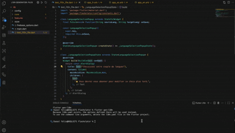

# Generate L10n - VSCode Extension

**Automate localization of Dart/Flutter projects using AI/LLMs directly from VSCode.**

[Download video for better quality](resources/demo.mp4)

---

## Table of Contents

* [Overview](#overview)
* [Features](#features)
* [Installation](#installation)
* [Usage](#usage)
* [Configuration](#configuration)
* [Commands](#commands)
* [Tree View](#tree-view)
* [Technical Details](#technical-details)
* [Troubleshooting](#troubleshooting)
* [Contributing](#contributing)
* [License](#license)

---

## Overview

`generate-l10n` is a VSCode extension designed to simplify the localization process for **Dart/Flutter projects**.
By leveraging **LLM models** (Mistral, OpenAI, Google), it automates the tedious task of extracting strings to `.arb` files and updating `.dart` code with the correct localization keys.

Whether you want to process **entire files** or just a **specific snippet of text**, the extension handles the context, key generation, and translation for you.

---

## Features

* **Smart Selection (New!):** Highlight text in a Dart file and use "Quick Fix" (lightbulb) to localize it instantly.
* **Contextual Intelligence:** The AI detects the source language and checks existing `.arb` files to reuse existing keys or create new ones consistently.
* **Batch Processing:** Interactive **tree view** to select and process multiple files at once.
* **Multi-Provider:** Support for Mistral, OpenAI, and Google Gemini models.
* **Automated Workflow:** Optionally executes `flutter gen-l10n` immediately after modification.
* **Native Integration:** Seamlessly integrated into the VSCode Activity Bar and Command Palette.

---

## Installation

1. Open **VSCode**.
2. Navigate to the **Extensions** sidebar.
3. Search for `generate-l10n`.
4. Click **Install**.
5. Once installed, the **L10n Generator** icon appears in the activity bar.

> No additional setup is required beyond the API key.

---

## Usage

### 1. Localize Selected Text (Quick Action)

* Highlight a string in your `.dart` file.
* Click the **Lightbulb 💡** icon, right-click or press `Cmd+.` / `Ctrl+.`.
* Select **"Auto-l10n: Localize Text"** (replaces text with key) or **"Auto-l10n: Localize & Build"** (replaces text + runs flutter gen-l10n).
* The AI will automatically update all your `.arb` files with the translated values.

### 2. Localize Entire Files (Batch)

* Click the **L10n Generator** icon in the activity bar.
* Expand the `/lib` folder tree and **check** the files you want to process.
* Press the **Play ▶** button.
* The extension will refactor the files to use `AppLocalizations`.

---

## Configuration

| Setting | Type | Default | Description |
| --- | --- | --- | --- |
| `generateL10n.provider` | string | `"mistral"` | LLM provider (`openai`, `mistral`, `google`) |
| `generateL10n.apiKey` | string | `""` | API key for the selected provider |
| `generateL10n.model` | string | `"mistral-large-latest"` | LLM model used for processing |
| `generateL10n.backup` | boolean | `false` | Create backup files before modifying code |
| `generateL10n.packageName` | string | `""` | Flutter project name (auto-detected) |

> **Note:** The API key is required for the extension to function.

> The model choice is crucial. Most of the tests were carried out using mistral-large-2411 and gemini-2.5-flash. Smaller or older models might not get the work done perfectly.

### Auto-detection

The extension automatically detects your Flutter project name from `pubspec.yaml` when activated. If the `packageName` setting is empty, it will be populated automatically and stored in your workspace settings.

You can manually re-detect the project name emptying it in the config tab.

---

## Commands & UI

### Command Palette (`Ctrl+Shift+P`)

* `Process Selected Files`: Starts batch localization.
* `Configure Extension`: Quick access to settings.
* `Refresh View`: Updates the file tree structure.

### Tree View

* Displays your `/lib` hierarchy (excluding `l10n` folder and non-Dart files).
* Provides a visual way to manage bulk localization tasks.

---

## Technical Details

The extension follows a modular **Object-Oriented Programming (OOP)** architecture for high maintainability:

* **Core Logic:** Separated into `L10nProcessor` for file handling and `LLMService` for AI logic.
* **REST Integration:** Migrated to a clean Fetch API implementation for LLM requests with strict JSON output parsing.
* **Providers:** Uses `CodeActionProvider` to inject localization commands directly into the VSCode editor UI.
* **Robust Parsing:** Handles LLM responses with built-in sanitization (markdown block removal, JSON validation).
* **Automation:** Built-in utility to trigger `flutter gen-l10n` via the VSCode Terminal API.

---

## Troubleshooting

* **No workspace open**: Open a Flutter project folder in VSCode.
* **Missing API key**: Set it via Settings (`generateL10n.apiKey`) or `Configure Extension` command.
* **No files checked**: Ensure you select at least one Dart file.
* **Flutter gen-l10n fails**: Verify Flutter SDK is installed and added to PATH.
* **Language Detection:** If the AI misidentifies the source language, ensure your existing `.arb` files follow the standard naming convention (e.g., `app_en.arb`, `app_fr.arb`).
* **Terminal Errors:** If `flutter gen-l10n` fails, ensure Flutter is in your system `PATH` and your `l10n.yaml` is correctly configured.
* **API Limits:** Check your LLM provider dashboard if you receive empty responses or "429 Too Many Requests" errors.

---

## Contributing

Contributions are welcome!

1. Fork the repository.
2. Install dependencies: `npm install`.
3. Run tests: `npm run test:unit`.
4. Submit a PR describing your changes (logic refactoring, new providers, etc.).

---

## License

MIT License © 2026