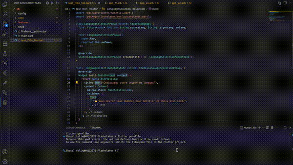

# Generate L10n - VSCode Extension

**Automate localization of Dart/Flutter projects using AI/LLMs directly from VSCode.**

[Download video for better quality](resources/demo.mp4)

---

## Table of Contents

* [Overview](#overview)
* [Features](#features)
* [Installation](#installation)
* [Usage](#usage)
* [Configuration](#configuration)
* [Commands](#commands)
* [Tree View](#tree-view)
* [Technical Details](#technical-details)
* [Troubleshooting](#troubleshooting)
* [Contributing](#contributing)
* [License](#license)

---

## Overview

`generate-l10n` is a VSCode extension designed to simplify and automate the localization process for **Dart/Flutter projects**.
It leverages **LLM models** (like Mistral, OpenAI, Google) to update `.dart` files and amend `.arb` localization files.

The extension provides an interactive **tree view**, file selection, and direct integration with the `flutter gen-l10n` command.

---

## Features

* Interactive **tree view** of Dart files under `/lib`.
* Check/uncheck files to include in the localization process.
* Input **API key** for LLM provider.
* Supports multiple **LLM providers** and all their models.
* Automatically executes `flutter gen-l10n` after processing.
* Full **VSCode native UI integration** (activity bar, command palette, tree view).

---

## Installation

1. Open **VSCode**.
2. Navigate to the **Extensions** sidebar.
3. Search for `generate-l10n`.
4. Click **Install**.
5. Once installed, the **L10n Generator** icon appears in the activity bar.

> No additional setup is required beyond the API key.

---

## Usage

1. Open a Flutter/Dart project in VSCode.
2. Click the **L10n Generator** icon in the activity bar.
3. Expand the `/lib` folder tree to locate Dart files.
4. Check the files you want to process.
5. Press the **Play ▶** button or run the command `Process Selected Files` from the command palette.
6. The extension will:

   * Use the configured LLM to modify Dart/ARB files.
   * Execute `flutter gen-l10n` in a terminal.
   * Notify you upon success or failure.

---

## Configuration

Configure the extension via **Settings** or the `configureExtension` command:

| Setting                    | Type    | Default                  | Description                                                    |
| -------------------------- | ------- | ------------------------ | -------------------------------------------------------------- |
| `generateL10n.provider`    | string  | `"mistral"`              | LLM provider to use (`openai`, `mistral`, `google`)            |
| `generateL10n.apiKey`      | string  | `""`                     | API key for the selected provider                              |
| `generateL10n.model`       | string  | `"mistral-small-latest"` | LLM model used for processing                                  |
| `generateL10n.backup`      | boolean | `false`                  | Create backup files before modifying ARB and Flutter files     |
| `generateL10n.packageName` | string  | `""`                     | Flutter project package name (auto-detected from pubspec.yaml) |

> **Note:** The API key is required for the extension to function.

> The model choice is crucial. Most of the tests were carried out using mistral-large-2411 and mistral-small-2509.

### Auto-detection

The extension automatically detects your Flutter project name from `pubspec.yaml` when activated. If the `packageName` setting is empty, it will be populated automatically and stored in your workspace settings.

You can manually re-detect the project name emptying it in the config tab.

---

## Commands

The extension registers the following commands:

| Command                             | Description                                                       |
| ----------------------------------- | ----------------------------------------------------------------- |
| `generateL10n.toggleCheck`          | Toggle check state of a file in the tree view.                    |
| `generateL10n.processSelectedFiles` | Process all checked files using the configured AI provider/model. |
| `generateL10n.configureExtension`   | Open extension settings for configuration.                        |
| `generateL10n.refreshView`          | Refresh the tree view to reflect changes in the file system.      |

> All commands are accessible via the **Command Palette** (`Ctrl+Shift+P` / `Cmd+Shift+P`).

---

## Tree View

* Displays the `/lib` folder hierarchy.
* Directories appear collapsible; Dart files are checkable.
* Checked files are included in LLM processing.
* NOT automatically refreshes when files are added or removed. Please remember to press the refresh button.
* Excludes: `node_modules`, `.git`, `/lib/l10n`.

---

## Technical Details

* Written in **TypeScript** for VSCode extension API.
* Uses the `langgraph` library for Dart/ARB file processing using LLM.
* Interacts with **LLMs** via provider APIs.
* Launches **Flutter commands** in a VSCode terminal.
* Fully modular: tree view, commands, and file processing separated for maintainability.

---

## Troubleshooting

* **No workspace open**: Open a Flutter project folder in VSCode.
* **Missing API key**: Set it via Settings (`generateL10n.apiKey`) or `Configure Extension` command.
* **No files checked**: Ensure you select at least one Dart file.
* **Flutter gen-l10n fails**: Verify Flutter SDK is installed and added to PATH.

---

## Contributing

Contributions are welcome!

* Fork the repository.
* Implement changes in `src/`.
* Test using `npm run test`.
* Submit a Pull Request with detailed description.

---

## License

MIT License © 2025
